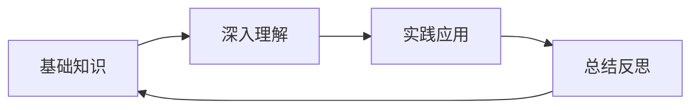

# 学习笔记

记录网络安全学习过程中的心得体会、技术总结和实战经验。

## 📝 学习记录

### CTF解题记录
- **[Web安全CTF题解](./ctf-writeups.md)** - 经典Web题目分析
- **[Pwn题解思路](./pwn-writeups.md)** - 二进制漏洞利用
- **[密码学题目破解](./crypto-writeups.md)** - 加密算法分析

### 技术研究
- **[最新CVE分析](./cve-analysis.md)** - 高危漏洞深度解析
- **[内网渗透总结](./internal-pentest-notes.md)** - 实战经验分享
- **[Android安全研究](./android-security-notes.md)** - 移动端安全技术

### 安全资讯
- **[2024年网络安全趋势](./security-trends-2024.md)**
- **[重大安全事件分析](./security-incidents.md)**
- **[新工具和技术分享](./new-tools-tech.md)**

## 🎯 学习方法

### 1. 理论学习


### 2. 实战练习
- **靶场练习** - 在安全的环境中练习技术
- **CTF比赛** - 通过竞赛提升技能
- **漏洞复现** - 跟踪最新漏洞进行复现

### 3. 知识分享
- **技术博客** - 记录学习过程
- **社区交流** - 与同行讨论技术
- **技术演讲** - 分享研究成果

## 📚 推荐资源

### 在线课程
- **[CISSP官方课程](https://www.isc2.org/Certifications/CISSP)**
- **[CEH认证培训](https://www.eccouncil.org/programs/certified-ethical-hacker-ceh/)**
- **[OSCP渗透测试认证](https://www.offensive-security.com/pwk-oscp/)**

### 技术社区
- **FreeBuf** - 国内知名安全媒体
- **先知社区** - 阿里云安全社区  
- **CSDN安全** - 技术分享平台
- **GitHub** - 开源安全工具

### 学习平台
- **TryHackMe** - 交互式网络安全培训
- **HackTheBox** - 渗透测试实验室
- **VulnHub** - 漏洞利用练习平台
- **OverTheWire** - Wargames挑战

## 🏆 学习成果

### 技能树
```
网络安全基础 ✅
├── 网络协议基础 ✅
├── 操作系统安全 ✅
├── Web应用安全 🔄
│   ├── SQL注入 ✅
│   ├── XSS攻击 ✅
│   └── 文件上传漏洞 🔄
├── 渗透测试 🔄
│   ├── 信息收集 ✅
│   ├── 漏洞扫描 ✅
│   └── 后渗透 📝
└── 移动端安全 📝
```

### 证书获得
- [ ] CEH (Certified Ethical Hacker)
- [ ] CISSP (Certified Information Systems Security Professional)
- [ ] OSCP (Offensive Security Certified Professional)
- [ ] CISM (Certified Information Security Manager)

---

> 💡 **学习心得**: 网络安全是一个需要持续学习的领域，保持好奇心和动手实践是最重要的！
