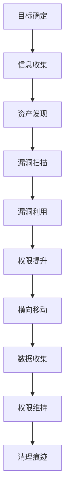

# 0x2 攻防演练

攻防演练是实战化的网络安全对抗，这里分享真实的红队攻击技术和经验。

## 📚 技术问答

### 🎯 攻防流程
- **你平时参加攻防演练，给你一个目标，你的流程是什么样子的？**

### 🔍 资产收集
- **做资产收集时，如何确保收集到的域名足够全面？**

### 🖥️ 提权技术
- **Linux除了内核提权，还有什么常用的提权方式？**

### 🎮 C2框架
- **平时用过哪些C2，除了Cobalt Strike还有其他的吗？**
- **如何隐藏自己的Cobalt Strike，避免被公网扫描发现？**
- **除了HTTP(S)和TCP，你还知道哪些C2通信的常见协议，它们特点是什么？**

### 💾 数据库利用
- **MSSQL执行命令的几种方式？**

### 🌐 网络代理
- **正反向代理的区别？**
- **你常用哪些方式和工具做流量代理，为什么喜欢用这种方式和工具？**

### 💻 Windows安全
- **Windows下你常用哪些权限维持方法？**
- **怎么做Bypass UAC的？**
- **Windows自启动的原理？**
- **如何隐藏用来维权的计划任务？**
- **Webshell下执行命令，提示 error 5，这种会是什么原因，怎么解决？**
- **怎么获取已保存的RDP凭据，大致原理是什么？**

### 🎣 钓鱼攻击
- **你平常钓鱼通常使用什么思路来找到对方的人员，以及用什么话术让对方打开木马？**
- **邮件钓鱼时怎么绕过对方的邮件网关，如何配置了拦截加密压缩包呢？**
- **有没有做过针对MacOS的钓鱼，思路是什么？**
- **钓鱼时有没有预防对方出网受限的措施，如何判断对方是哪种协议可出网？**

### 🔒 OPSEC安全
- **讲讲你知道的攻防演练中的opsec？**

### 🔑 凭证获取
- **你知道的抓取凭证的方法，除了内存中还有哪里可以获取？**
- **平时用什么工具获取浏览器或常见运维工具的密码？**

### 🏢 企业环境
- **有没有打过vCenter，如果上面的机器都锁屏了且没有密码，怎么利用？**
- **如果发现已经控制的主机上有zabbix agent，怎么打zabbix server？**

---

## 🎯 攻防演练流程

## 🛠️ 常用工具

### 信息收集
- **subfinder** - 子域名枚举
- **amass** - 综合信息收集
- **httpx** - HTTP探测
- **nuclei** - 漏洞扫描

### C2框架
- **Cobalt Strike** - 商业C2框架
- **Metasploit** - 开源渗透框架
- **Empire** - PowerShell C2
- **Covenant** - .NET C2框架

### 代理工具
- **proxychains** - Linux代理链
- **reGeorg** - Web代理
- **Neo-reGeorg** - 改进版Web代理
- **Stowaway** - 多级代理

---

> ⚔️ **攻防心得**: 攻防演练不仅是技术的较量，更是策略和耐心的比拼。要学会从防守者的角度思考问题。
