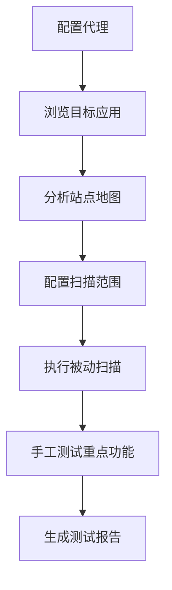

# Burp Suite 使用指南

Burp Suite是Web应用安全测试的首选工具，被广泛应用于渗透测试和漏洞挖掘中。

## 🎯 Burp Suite简介

Burp Suite是由PortSwigger公司开发的集成化Web应用安全测试工具，包含了多个模块，能够实现对Web应用的全面安全评估。

### 版本对比

| 功能特性 | Community版 | Professional版 |
|----------|-------------|----------------|
| 代理拦截 | ✅ | ✅ |
| 重放器 | ✅ | ✅ |
| 解码器 | ✅ | ✅ |
| 比较器 | ✅ | ✅ |
| 主动扫描 | ❌ | ✅ |
| Intruder爆破 | 限制 | ✅ |
| 扩展插件 | 限制 | ✅ |

## 🛠️ 核心模块详解

### 1. Proxy 代理模块
```bash
# 默认监听端口
127.0.0.1:8080

# 浏览器代理配置
HTTP代理: 127.0.0.1:8080
HTTPS代理: 127.0.0.1:8080
```

**主要功能：**
- 拦截HTTP/HTTPS请求和响应
- 修改数据包内容
- 历史记录查看
- SSL证书处理

### 2. Target 目标管理
- **站点地图** - 展示应用结构
- **作用域定义** - 限制测试范围  
- **问题汇总** - 发现的漏洞列表

### 3. Spider 爬虫模块
```python
# 配置爬虫参数
最大链接深度: 10
并发线程数: 10
请求延迟: 100ms
表单处理: 自动提交
```

### 4. Scanner 扫描器（Pro版）
- **被动扫描** - 分析流量中的安全问题
- **主动扫描** - 主动发送攻击载荷
- **扫描配置** - 自定义扫描策略

### 5. Intruder 攻击模块
#### 攻击类型
1. **Sniper** - 单一位置攻击
2. **Battering ram** - 同一载荷多位置
3. **Pitchfork** - 载荷集合配对
4. **Cluster bomb** - 载荷集合排列组合

#### 载荷设置
```bash
# 常用载荷类型
- Simple list: 简单列表
- Runtime file: 文件载荷
- Numbers: 数字序列
- Brute forcer: 暴力破解
- Null payloads: 空载荷
```

### 6. Repeater 重放器
- 手动修改请求
- 重复发送测试
- 响应对比分析
- 编码处理

## ⚡ 实战技巧

### 1. SQL注入测试
```sql
-- 在Repeater中测试SQL注入
' OR 1=1 --
' UNION SELECT 1,2,3 --
' AND 1=2 UNION SELECT database(),user(),version() --
```

### 2. XSS测试载荷
```html
<!-- 常用XSS载荷 -->
<script>alert('XSS')</script>

<svg onload=alert('XSS')>
```

### 3. 目录遍历测试
```bash
# Intruder载荷设置
../../../etc/passwd
..\..\..\..\windows\system32\drivers\etc\hosts
....//....//....//etc/passwd
```

### 4. Bypass WAF技巧
```sql
-- SQL注入WAF绕过
/*!50000SELECT*/ * FROM users
SELECT/**/password/**/FROM/**/users
SELECT(password)FROM(users)
```

## 🔧 插件推荐

### 必装插件
1. **Logger++** - 增强日志功能
2. **Authorize** - 授权测试
3. **Upload Scanner** - 文件上传测试
4. **J2EEScan** - Java应用扫描
5. **Active Scan++** - 增强扫描功能

### 插件安装
```bash
# BApp Store安装
1. Extender -> BApp Store
2. 搜索插件名称
3. 点击Install安装

# 手动安装
1. 下载.jar文件
2. Extender -> Extensions
3. Add -> Java -> 选择jar文件
```

## 📊 最佳实践

### 1. 测试流程


### 2. 配置优化
```json
{
  "proxy": {
    "intercept_requests": true,
    "intercept_responses": false,
    "invisible_proxying": true
  },
  "spider": {
    "max_link_depth": 5,
    "check_robots_txt": true,
    "detect_custom_404": true
  }
}
```

### 3. 报告生成
- **HTML报告** - 适合客户查看
- **XML报告** - 便于数据处理
- **自定义模板** - 符合公司规范

## 🎓 学习建议

### 新手入门
1. 熟悉界面布局和基本功能
2. 练习代理拦截和修改请求
3. 学会使用Repeater进行手工测试
4. 掌握Intruder的各种攻击模式

### 进阶技能
1. 编写自定义扫描规则
2. 开发Burp插件
3. 与其他工具联动使用
4. 自动化测试脚本开发

---

> 🔍 **提示**: Burp Suite功能强大，需要大量实践才能熟练掌握。建议在合法的测试环境中多加练习！
